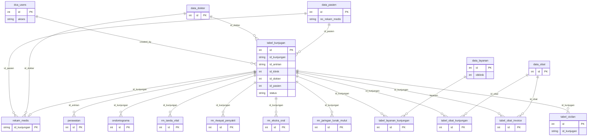

# RSGM USU — Migration Plan to Modern Stack

**Rumah Sakit Gigi dan Mulut Universitas Sumatera Utara**  
Legacy Hospital Information System → React + Node.js + TiDB on Vercel

---

## 1. Executive Summary

### What This System Does
RSGM USU is a **dental and oral hospital information system** for Universitas Sumatera Utara. It supports:
- **Patient registration and records** (data pasien, no rekam medis)
- **Queue and visit management** (antrian, kunjungan) across multiple clinics (IKGP, Periodonsia, Ilmu Penyakit Mulut, etc.)
- **Clinical workflows**: medical records (rekam medis), odontogram, vital signs, extra-oral/intra-oral exams, treatment plans (perawatan)
- **Pharmacy (apotek)**: drug master data, prescriptions per visit, invoices
- **Cashier (kasir)**: billing, payments, installments (cicilan)
- **Admin**: users, doctors (dokter), services (layanan), medicines (obat), reporting

### Number of Modules Found
| Module    | Purpose                          | Key entry points      |
|-----------|----------------------------------|------------------------|
| **Landing** | Public / role selection          | `index.html` (Klinik, Apotek, Kasir, Admin) |
| **Frontdesk** | Reception, queue, patient list   | `frontdesk/`          |
| **Klinik**   | Clinical: RM, perawatan, odontogram | `klinik/`          |
| **Apotek**   | Pharmacy, drug list, invoices    | `apotek/`             |
| **Kasir**    | Cashier, payments, installments  | `kasir/`              |
| **Admin**    | Master data, users, reports      | `admin/`               |
| **Cetak**    | Reports, export RM               | `cetak/` (PHP)        |
| **Print**    | Invoice printing                 | `print/` (PHP)        |
| **Form**     | Edit layanan/obat (shared)      | `form/`               |

**Total: 9 functional areas** (7 main app modules + cetak + print).

### Estimated Complexity per Module
| Module    | Complexity | Notes |
|-----------|------------|--------|
| Landing   | Low        | Static role picker; replace with React router entry |
| Frontdesk | High       | Queue, dashboard, submit to klinik, many API calls |
| Klinik    | High       | RM forms, odontogram, perawatan, layanan/obat, many endpoints |
| Apotek    | Medium     | CRUD obat, invoice list, linked to kunjungan |
| Kasir     | High       | List unpaid/paid, complete order, cicilan, export Excel |
| Admin     | Medium     | CRUD users, dokter, layanan, obat; dashboard |
| Cetak     | Medium     | Date-range reports, export rekam medis (PHP + Excel) |
| Print     | Medium     | Invoice + cicilan print (PHP, HTML) |
| Form      | Low        | Modal-like edit forms; can be components |

### Total Estimated Migration Effort
- **Rough order of magnitude:** 40–60 person-days (foundation + core + supporting + print/reporting + testing), depending on team size and parallelization.
- **Critical path:** Auth → Pasien/Kunjungan → Rekam Medis/Perawatan → Kasir/Apotek → Print/Export.

---

## 2. Cleanup Report

### Cleanup Summary
- **Total files deleted:** ~1,500+ (all files under removed folders + 11 individual files)
- **Total size freed:** ~34 MB
- **Folders removed:**
  - `vendor/` — legacy PHP/JS vendor libs (Bootstrap, jQuery, DataTables, Angular, etc.)
  - `vendors/` — PHPExcel and dependencies
  - `libs/` — Angular UI, jQuery plugins, assets
  - `psd/` — design source (ui.png, ui.zip)
  - `swig/` — Swig template engine
  - `tpl/` — Smarty/HTML templates
  - `l10n/` — AngularJS locale files (en, de_DE, it_IT)
  - `js/confirm/` — empty after removing angular-confirm.min.js/css

- **Files deleted (individual):**
  - `.DS_Store` (root and `folderdatabase/`) — macOS system
  - `js/angular-datepicker.js` — bundled legacy lib
  - `landing/css/app.min.css` — compiled asset
  - `js/confirm/angular-confirm.min.js`, `angular-confirm.min.css` — compiled
  - `js/app.min.js` — compiled app bundle
  - `src/angular/angular.min.js`, `src/angular/angular-route.min.js` — compiled Angular

- **Files intentionally kept:**
  - `folderdatabase/db.sql` — SQL schema reference
  - `api/`, `apidb/` — PHP backend reference for rewriting
  - `config/` — db_config.php, db_connect.php, userauth.php, etc.
  - All HTML/JS in `frontdesk/`, `klinik/`, `apotek/`, `kasir/`, `admin/`, `cetak/`, `print/`, `form/`, `landing/` — feature reference
  - `README.md`, `index.html` — entry and docs
  - `img/`, `favi/` — assets for possible reuse
  - `css/` — design reference
  - `js/` (remaining) — app.js, controllers, services, directives for behavior reference

---

## 3. Existing System Inventory

### 3.1 Database Schema

**Source:** `folderdatabase/db.sql` (phpMyAdmin dump).  
**Note:** Some columns and one table referenced in PHP are **not** in the dump (see below).

#### Tables (as in db.sql)

| Table | Columns | PK | Notes |
|-------|---------|-----|--------|
| `data_dokter` | id, nama, jenis_kelamin, nomor_hp | id | Doctor master |
| `data_layanan` | id, layanan, bahan, harga_bahan, idklinik, harga_koas, harga_drg, harga_drgsp | id | Services per clinic |
| `data_obat` | id, nama, quantity, satuan, harga | id | Drug master |
| `data_pasien` | id, no_rekam_medis, tgl_registrasi, nama, tempat_lahir, tanggal_lahir, jenis_kelamin, agama, alamat, rtrw, kelurahan, kecamatan, kabupaten, propinsi, nomor_hp, kewarganegaraan, noktp, pendidikan, pekerjaan, status_perkawinan, tgl_pertama_masuk, cara_bayar, tujuan_kunjungan_pertama, alergi, catatan, tinggi_badan, berat_badan, golongan_darah | id | Patient master |
| `dca_users` | id, username, password, akses | id | Users and role (akses) |
| `ondontograma` | id, id_kunjungan, id_antrian, id_pasien, keterangan (JSON text) | id | Odontogram data (note: typo in name) |
| `perawatan` | id, id_pasien, id_antrian, id_klinik, element, diagnosa, perawatan, id_dokter, nama_dokter, icd10 | id | Treatment records |
| `rekam_medis` | id_kunjungan, id_pasien, id_dokter, nama_dokter, amnese, diagnosa | id_kunjungan | Medical record header |
| `rm_ekstra_oral` | id, id_antrian, id_kunjungan, id_pasien, tonus_bibir, tmj, kelenjar_limfe, kelainan_tmj, keterangan_ekstra_oral | id | Extra-oral exam |
| `rm_jaringan_lunak_mulut` | id, id_kunjungan, id_antrian, id_pasien, kebersihan_mulut, mukosa_bukal, kelainan_mukosa_bukal, mukosa_labial, kelainan_mukosa_labial, frenulum_labial, kelainan_frenulum_labial, lidah, kelainan_lidah, palatum, kelainan_palatum, tonsil, kelainan_tonsil, dasar_mulut, kelainan_dasar_mulut, gingiva, kelainan_gingiva, keterangan_jaringan_lunak_mulut | id | Soft tissue exam |
| `rm_riwayat_penyakit` | id, id_kunjungan, id_antrian, id_pasien, status_jantung, keterangan_jantung, status_hipertensi, keterangan_hipertensi, status_diabetes, keterangan_diabetes, status_alergi, keterangan_alergi, status_asma, keterangan_asma, status_hepar, keterangan_hepar, status_lambung, keterangan_lambung, status_lain, keterangan_lain | id | Medical history |
| `rm_tanda_vital` | id, id_kunjungan, id_antrian, id_pasien, kesadaran, kondisi_umum, tekanan_darah, denyut_nadi, pernafasan, suhu | id | Vital signs |
| `tabel_kunjugan` | id, id_kunjungan, id_antrian, id_klinik, dokter_pendamping, id_dokter, id_pasien, status | id | Visit/queue (typo: kunjugan) |
| `tabel_layanan_kunjungan` | id, id_pasien, nama_pasien, id_kunjungan, id_antrian, nama_layanan, harga_bahan, harga_layanan, status | id | Services per visit |
| `tabel_obat_invoice` | id, id_pasien, id_kunjungan, id_obat, nama_obat, satuan, quantity, harga, tanggal | id | Drug invoice lines |
| `tabel_obat_kunjungan` | id, id_pasien, nama_pasien, id_kunjungan, id_antrian, id_obat, nama_obat, satuan, quantity, harga, status | id | Drugs per visit |
| `tidakan_medis` | id, nama_tindakan, klinik, harga_bahan, harga_tindakan_medis_1..4 | id | Medical procedures (typo: tidakan) |

#### ⚠️ Schema gaps (in code but not in db.sql)
- **`tabel_kunjugan`:** PHP uses `status_pembayaran`, `tanggal_pembayaran`, `biaya_rekam_medis`, `tanggal_kunjungan` — **add these columns** in Prisma/migration.
- **`tabel_cicilan`:** Used in `apidb/kasir/submit_cicilan.php` and `list_data_cicilan.php` with columns: `id`, `id_kunjugan`, `keterangan`, `biaya`, `tanggal`. **Table missing from dump** — must be created in TiDB.

#### ERD (Mermaid)



---

### 3.2 API Endpoints Inventory

**Base path:** `/apidb/` (and `/config/userauth.php` for login).  
**Convention:** Most GETs use query params; many POSTs/PUTs use JSON body via `php://input`.  
**Auth:** No token in API; session/cookie via `config/userauth.php`. All apidb endpoints are assumed to be used after login (role not always enforced in PHP).

| Method | URL (relative) | Description | Input | Output |
|--------|----------------|-------------|--------|--------|
| POST | config/userauth.php | Login | username, password (form) | JSON: status (correct/wrong), akses |
| GET | apidb/antrian/list_data.php | Dashboard queue counts per clinic | — | event[]: ikgp, PERIODONSIA, ipm, ikga, konservasi, prosotodonsia, bedahmulut, ortodonsia, radiologi, pengunjung, datapasien |
| GET | apidb/apotek/delete_obat.php | Delete drug from invoice/visit | id (query) | — |
| GET | apidb/apotek/invoice_list_data_obat.php | List drugs for invoice by visit | id (id_kunjungan) | event[] |
| GET | apidb/apotek/list_data_obat.php | List drugs (apotek context) | — | event[] |
| POST | apidb/apotek/submit_obat.php | Submit drug to visit/invoice | (body) | — |
| POST | apidb/datapasien/submit_dokter_pasien.php | Assign doctor to patient/visit | (body) | — |
| POST | apidb/datapasien/submit_ke_klinik.php | Send patient to clinic (create kunjungan) | idKunjungan, idAntrian, idKlinik, newRekamMedis, dokterPendamping, idDokter, idPasien | — |
| DELETE | apidb/dokter/delete.php | Delete doctor | (body) | — |
| GET | apidb/dokter/get.php | Get one doctor | (body newId) | doctor object |
| GET | apidb/dokter/list_data.php | List all doctors | — | event[] |
| GET | apidb/dokter/list_dokter_get.php | List doctors by clinic | id (id_klinik) | event[] |
| POST | apidb/dokter/post.php | Create doctor | (body) | — |
| POST | apidb/dokter/postedit.php | Update doctor | (body) | — |
| GET | apidb/kasir/complete_order.php | Mark visit as paid | POST body: idKunjungan | — |
| GET | apidb/kasir/hapus_data_tagihan.php | Remove/void bill for visit | id (id_kunjungan) | — |
| GET | apidb/kasir/list_data_cicilan.php | List installments for visit | id_kunjugan (query) | event[] |
| POST | apidb/kasir/submit_cicilan.php | Add installment payment | idKunjungan, pembayaran, keterangan, tglpembayaran | — |
| GET | apidb/klinik/get_odontograma.php | Get odontogram by visit | (query) | — |
| GET | apidb/klinik/get_rekam_medis.php | Get RM header | (query) | — |
| GET | apidb/klinik/get_riwayat_penyakit.php | Get medical history for visit | (query) | — |
| GET | apidb/klinik/get_tanda_vital.php | Get vital signs for visit | (query) | — |
| GET | apidb/klinik/list_data_kunjugan_klinik.php | List visit data for one kunjungan | idkunjungan | event[] |
| GET | apidb/klinik/list_data_layanan_no.php | List services for visit (no status?) | id (id_kunjungan) | event[] |
| GET | apidb/klinik/list_perawatan_pasien.php | List perawatan by patient | idpasien | event[] |
| GET | apidb/klinik/list_rekam_medis.php | List RM | (params) | event[] |
| GET | apidb/klinik/list_rekam_medis_pasien.php | List RM by patient | idpasien | event[] |
| PUT | apidb/klinik/put_odontograma.php | Save odontogram | (body) | — |
| PUT | apidb/klinik/put_rm_ekstra_oral.php | Save extra-oral | (body) | — |
| PUT | apidb/klinik/put_rm_jaringan_lunak_mulut.php | Save soft tissue | (body) | — |
| PUT | apidb/klinik/put_rm_riwayat_penyakit.php | Save medical history | (body) | — |
| PUT | apidb/klinik/put_rm_tanda_vital.php | Save vital signs | (body) | — |
| POST | apidb/klinik/submit_layanan_kunjungan.php | Add service to visit | (body/query) | — |
| POST | apidb/klinik/submit_obat_invoice.php | Add drug to invoice | (body) | — |
| POST | apidb/klinik/submit_obat_kunjungan.php | Add drug to visit | (body) | — |
| POST | apidb/klinik/submit_perawatan.php | Add perawatan | (body) | — |
| POST | apidb/klinik/submit_rekam_medis.php | Create/update RM, update kunjungan status | idKunjungan, idAntrian, idPasien, idDokter, namaDokter, amnese, diagnosa, cicilan | — |
| GET | apidb/kunjungan/export_ke_excel.php | Export kunjungan to Excel | tawal, takhir, klinik, status (query) | Excel file |
| GET | apidb/kunjungan/get.php | Get one visit full | id (query) | visit + patient + RM summary |
| GET | apidb/kunjungan/getp.php | Get visit (alternate) | (query) | — |
| GET | apidb/kunjungan/list_data.php | List visits by clinic + status | id, status | event[] |
| GET | apidb/kunjungan/list_data_cicilan_kasir.php | List visits with installment | — | event[] |
| GET | apidb/kunjungan/list_data_kasir.php | List unpaid visits (kasir) | — | event[] |
| GET | apidb/kunjungan/list_data_kasir_cari_biasa.php | Search unpaid by keyword | id (keyword) | event[] |
| GET | apidb/kunjungan/list_data_kasir_sudah_bayar.php | List paid visits | — | event[] |
| GET | apidb/kunjungan/list_data_kasir_sudah_bayar_search.php | Search paid by date/klinik/status | tawal, takhir, klinik, status | event[] |
| GET | apidb/kunjungan/list_data_kasir_today.php | Paid today | — | event[] |
| GET | apidb/kunjungan/list_data_kunjungan_dashboard.php | Dashboard visits | id, status | event[] |
| GET | apidb/kunjungan/list_data_kunjungan_masuk.php | Incoming queue by clinic | id (id_klinik), status=0 | event[] |
| GET | apidb/kunjungan/list_data_no.php | List visit numbers | (query) | — |
| GET | apidb/kunjungan/list_data_riwayat.php | History by clinic | id, status=2 | event[] |
| GET | apidb/kunjungan/update_ts.php | Update timestamp? | (query) | — |
| GET | apidb/layanan/edit_layanan_rm.php | Edit service line (RM) | id, bahan, layanan (query) | — |
| GET | apidb/layanan/edit_layanan_rm_icd.php | Edit service line with ICD | id, nama, bahan, layanan, icd | — |
| GET | apidb/layanan/edit_obat_rm.php | Edit drug line (RM) | id, nama, quantity, harga | — |
| GET | apidb/layanan/get.php | Get one service | (body/query) | — |
| GET | apidb/layanan/hapus_layanan_rm.php | Delete service line | id | — |
| GET | apidb/layanan/hapus_obat_rm.php | Delete drug line | id | — |
| GET | apidb/layanan/list_data.php | List services by clinic | id (id_klinik) | event[] |
| POST | apidb/layanan/post.php | Create service | (body) | — |
| POST | apidb/layanan/postedit.php | Update service | (body) | — |
| GET | apidb/layanan/submit_layanan_rm.php | Add service to visit (RM) | id_pasien, id_kunjungan, nama_pasien, nama_layanan, harga_bahan, harga_layanan (query) | — |
| GET | apidb/layanan/submit_obat_rm.php | Add drug to visit (RM) | id_pasien, id_kunjungan, nama_pasien, id_obat, nama_obat, harga_obat, quantity_obat, satuan_obat (query) | — |
| GET | apidb/layanan/delete.php | Delete service master | (body) | — |
| GET | apidb/obat/delete.php | Delete drug master | (body) | — |
| GET | apidb/obat/get.php | Get one drug | (body newId) | — |
| GET | apidb/obat/list_data.php | List all drugs | — | event[] |
| POST | apidb/obat/post.php | Create drug | (body) | — |
| POST | apidb/obat/postedit.php | Update drug | (body) | — |
| GET | apidb/pasien/delete.php | Delete patient | (body) | — |
| GET | apidb/pasien/get.php | Get patient by no_rekam_medis | POST body: newId | patient object |
| GET | apidb/pasien/list_data.php | List patients | — | event[] |
| GET | apidb/pasien/list_data_paging.php | List patients (paged) | (query) | — |
| GET | apidb/pasien/list_search.php | Search patients | (query) | — |
| POST | apidb/pasien/post.php | Create patient | (body) | — |
| POST | apidb/pasien/postedit.php | Update patient | (body) | — |
| GET | apidb/rekam_medis/get_odontograma.php | Get odontogram | (query) | — |
| GET | apidb/rekam_medis/get_odontograma_perawatan.php | Get odontogram for perawatan | (query) | — |
| GET | apidb/rekam_medis/get_perawatan.php | Get perawatan | (query) | — |
| GET | apidb/rekam_medis/get_rekam_medis.php | Get RM | (query) | — |
| GET | apidb/rekam_medis/get_rm_ekstra_oral.php | Get extra-oral | (query) | — |
| GET | apidb/rekam_medis/get_rm_jaringan_lunak_mulut.php | Get soft tissue | (query) | — |
| GET | apidb/rekam_medis/get_rm_riwayat_penyakit.php | Get medical history | (query) | — |
| GET | apidb/rekam_medis/get_rm_tanda_vital.php | Get vital signs | (query) | — |
| POST | apidb/rekam_medis/update_perawatan.php | Update perawatan | (body) | — |
| POST | apidb/rekam_medis/update_perawatan_form.php | Update perawatan (form) | (body) | — |
| GET | apidb/search/search-pasien.php | Search patients | keyword | event[] |
| GET | apidb/search/search-layanan.php | Search services | keyword | event[] |
| GET | apidb/search/search-perawatan.php | Search perawatan | keyword | event[] |
| GET | apidb/search/search-riwayat.php | Search riwayat | (query) | — |
| GET | apidb/tindakan_medis/list_data.php | List tindakan medis | — | event[] |
| GET | apidb/users/delete.php | Delete user | (body) | — |
| GET | apidb/users/get.php | Get one user | (body) | — |
| GET | apidb/users/list_data.php | List users | — | event[] (id, username, akses) |
| POST | apidb/users/post.php | Create user | (body) | — |
| POST | apidb/users/postedit.php | Update user | (body) | — |

**Legacy /api/** (mock or unused in main flow): `api/login`, `api/signup`, `api/datatable.json`, `api/saveUser`, `api/groups` — JSON files or minimal; real auth is `config/userauth.php`.

---

### 3.3 Module Inventory

| Module | Purpose | Key features | Forms / UI | API usage (main) |
|--------|---------|--------------|------------|------------------|
| **Landing** | Role selection | Links to Klinik, Apotek, Kasir, Admin | Buttons/cards | None |
| **Frontdesk** | Reception | Dashboard (antrian list_data), patient list, daftar pasien, submit to klinik (submit_ke_klinik), choose dokter, view RM/perawatan, search pasien/layanan/perawatan, add layanan/obat to visit | Patient CRUD, kunjungan form, layanan/obat modals | antrian, pasien, kunjungan, dokter, datapasien, klinik (list RM, perawatan, list_data_kunjugan_klinik), layanan, obat, users, search-* |
| **Klinik** | Clinical | Queue (list_data_kunjungan_masuk), assign dokter (submit_dokter_pasien), RM (amnese, diagnosa), vital/riwayat/ekstra/jaringan, odontogram, perawatan, layanan/obat for visit, hapus_data_tagihan | RM form, odontogram, perawatan, vital/riwayat/ekstra/jaringan, layanan/obat edit | kunjungan, dokter, pasien, klinik/*, rekam_medis/*, layanan, obat, kasir/hapus_data_tagihan |
| **Apotek** | Pharmacy | List obat, list pasien, invoice list by visit, delete obat from invoice | Drug list, invoice table | apotek/*, pasien, obat, users, dokter, datapasien, kunjungan, klinik (list RM, perawatan), layanan |
| **Kasir** | Cashier | List unpaid (list_data_kasir, list_data_kasir_cari_biasa), complete order, list cicilan, submit cicilan, list paid (list_data_kasir_sudah_bayar_search), export Excel | Payment form, cicilan form, date filter | kunjungan/*, kasir/*, layanan, obat |
| **Admin** | Master & config | Dashboard, CRUD pasien, dokter, obat, layanan, users; view klinik/rekam-medis | All CRUD forms, tables | pasien, dokter, obat, layanan, users, kunjungan, antrian, tindakan_medis |
| **Cetak** | Reports | Date range, status filter, export rekam medis, laporan (Excel) | Date/status filters | Direct DB in PHP |
| **Print** | Invoices | Print invoice (pasien, kunjungan), print cicilan | HTML print layout | Direct DB in PHP |
| **Form** | Shared edits | edit_layanan, edit_obat, edit_layanan_icd | Modal-like HTML | Used by frontdesk/klinik/kasir |

---

## 4. User Roles & Access Control

- **Source:** `dca_users.akses` and login flow in `config/userauth.php`; cookies: `username`, `akses`, and for Klinik `klinik`.
- **Sample values:** `akses`: 1, 2, 3 (exact role names not defined in code).
  - **1** — likely Admin (users with akses 1 in dump: iqbal, dodi, didi, duda).
  - **2** — likely Dokter (user "dokter").
  - **3** — likely Frontdesk/Kasir (joni, dede).

**Mapping (inferred):**

| Role (inferred) | akses | Modules (intended) |
|------------------|-------|--------------------|
| Admin | 1 | admin/*, full CRUD |
| Dokter | 2 | klinik/* (by klinik cookie) |
| Frontdesk / Kasir / Apotek | 3 | frontdesk, kasir, apotek |

**Note:** The legacy app does not consistently enforce role checks on each API; redirect by role is done at login (which app to load). The new system should enforce role-based access on every API and route.

---

## 5. Target Architecture

### 5.1 Monorepo Folder Structure

```
/
├── frontend/                    # React (Vite)
│   ├── public/
│   ├── src/
│   │   ├── main.jsx
│   │   ├── App.jsx
│   │   ├── pages/               # One per route
│   │   │   ├── Landing.jsx
│   │   │   ├── login/
│   │   │   ├── frontdesk/
│   │   │   ├── klinik/
│   │   │   ├── apotek/
│   │   │   ├── kasir/
│   │   │   └── admin/
│   │   ├── components/          # Shared UI
│   │   │   ├── ui/              # shadcn/ui
│   │   │   ├── layout/
│   │   │   ├── forms/
│   │   │   └── tables/
│   │   ├── hooks/
│   │   ├── lib/
│   │   │   ├── api.js           # Axios instance
│   │   │   └── auth.js
│   │   └── routes.jsx
│   ├── index.html
│   ├── vite.config.js
│   └── package.json
├── api/                         # Vercel Serverless (Express-style)
│   ├── auth/
│   │   └── login.js             # POST /api/auth/login
│   ├── antrian/
│   │   └── list_data.js
│   ├── apotek/
│   ├── datapasien/
│   ├── dokter/
│   ├── kasir/
│   ├── klinik/
│   ├── kunjungan/
│   ├── layanan/
│   ├── obat/
│   ├── pasien/
│   ├── rekam_medis/
│   ├── search/
│   ├── tindakan_medis/
│   ├── users/
│   ├── _lib/
│   │   ├── db.js                # Prisma client
│   │   └── auth.js              # JWT verify
│   └── vercel.json              # or at root
├── prisma/
│   ├── schema.prisma
│   ├── migrations/
│   └── seed.js
├── plan.md
├── README.md
└── vercel.json                  # Root: rewrites for /api and frontend
```

### 5.2 Vercel Deployment Configuration

**vercel.json (root):**

```json
{
  "buildCommand": "cd frontend && npm run build",
  "outputDirectory": "frontend/dist",
  "framework": "vite",
  "rewrites": [
    { "source": "/api/:path*", "destination": "/api/:path*" },
    { "source": "/(.*)", "destination": "/frontend/index.html" }
  ],
  "functions": {
    "api/**/*.js": {
      "memory": 1024,
      "maxDuration": 10
    }
  },
  "env": {
    "DATABASE_URL": "@tidb-url"
  }
}
```

- **Serverless limits:** 10s timeout (configurable); cold starts possible — keep serverless handlers thin and DB connection via Prisma (connection pooling). For heavy Excel export, consider streaming or background job (or separate serverless with longer timeout).

### 5.3 Database Migration Plan

- **Target:** TiDB Serverless (MySQL-compatible). Use Prisma with `provider = "mysql"` and TiDB connection string.
- **Approach:** Create Prisma schema from existing tables; add missing columns/table from code analysis; run migrations against empty TiDB, then data migration from legacy MySQL (export/import or ETL script).
- **Schema improvements to consider:**
  - Add foreign keys in Prisma (logical relations; TiDB supports FKs).
  - Fix typos in table names only if doing a clean cut (e.g. `tabel_kunjugan` → `tabel_kunjungan`, `ondontograma` → `odontograma`, `tidakan_medis` → `tindakan_medis`). For minimal change, keep names and add a note.
  - Index: `tabel_kunjugan(id_klinik, status)`, `tabel_kunjugan(status_pembayaran)`, `rekam_medis(id_pasien)`, `tabel_layanan_kunjungan(id_kunjungan)`, `tabel_obat_kunjungan(id_kunjungan)`.
  - Store passwords hashed (e.g. bcrypt) in `dca_users`; never plain text.

#### Proposed schema.prisma (with inferred missing columns/table)

```prisma
generator client {
  provider = "prisma-client-js"
}

datasource db {
  provider = "mysql"
  url      = env("DATABASE_URL")
}

model DataDokter {
  id           Int    @id @default(autoincrement())
  nama         String @db.VarChar(300)
  jenis_kelamin String @db.VarChar(1)
  nomor_hp     String @db.VarChar(24)
}

model DataLayanan {
  id           Int    @id @default(autoincrement())
  layanan      String @db.VarChar(300)
  bahan        String @db.Text
  harga_bahan  Int
  idklinik     Int
  harga_koas   Int
  harga_drg    Int
  harga_drgsp  Int
}

model DataObat {
  id       Int    @id @default(autoincrement())
  nama     String @db.VarChar(300)
  quantity String @db.VarChar(300)
  satuan   String @db.VarChar(300)
  harga    Int
}

model DataPasien {
  id                      Int     @id @default(autoincrement())
  no_rekam_medis          String  @unique @db.VarChar(20)
  tgl_registrasi          DateTime @db.Date
  nama                    String  @db.VarChar(200)
  tempat_lahir            String  @db.VarChar(20)
  tanggal_lahir           DateTime @db.Date
  jenis_kelamin           String  @db.VarChar(200)
  agama                   String  @db.VarChar(20)
  alamat                  String  @db.VarChar(200)
  rtrw                    String  @db.VarChar(10)
  kelurahan               String  @db.VarChar(20)
  kecamatan               String  @db.VarChar(20)
  kabupaten               String  @db.VarChar(20)
  propinsi                String  @db.VarChar(20)
  nomor_hp                String  @db.VarChar(200)
  kewarganegaraan         String  @db.VarChar(20)
  noktp                   String  @db.VarChar(50)
  pendidikan              String  @db.VarChar(20)
  pekerjaan               String  @db.VarChar(20)
  status_perkawinan       String  @db.VarChar(30)
  tgl_pertama_masuk       DateTime @db.Date
  cara_bayar              String  @db.VarChar(20)
  tujuan_kunjungan_pertama String @db.VarChar(50)
  alergi                  String  @db.VarChar(100)
  catatan                 String  @db.Text
  tinggi_badan            String  @db.VarChar(20)
  berat_badan             String  @db.VarChar(20)
  golongan_darah          String  @db.VarChar(2)
}

model DcaUser {
  id       Int     @id @default(autoincrement())
  username String? @db.VarChar(50)
  password String? @db.VarChar(255)  // store hashed
  akses    String  @db.VarChar(50)
}

model TabelKunjugan {
  id                   Int      @id @default(autoincrement())
  id_kunjungan         String   @db.VarChar(200)
  id_antrian           String   @db.VarChar(200)
  id_klinik            Int
  dokter_pendamping     String   @db.VarChar(300)
  id_dokter            Int
  id_pasien            Int
  status               String   @db.VarChar(1)
  status_pembayaran    String?  @db.VarChar(1)   // inferred from code
  tanggal_pembayaran   DateTime? @db.Date
  biaya_rekam_medis    String?  @db.VarChar(50)
  tanggal_kunjungan    DateTime? @db.Date
}

model RekamMedis {
  id_kunjungan String @id @db.VarChar(20)
  id_pasien    String  @db.VarChar(20)
  id_dokter    String  @db.VarChar(20)
  nama_dokter  String  @db.Text
  amnese       String  @db.Text
  diagnosa     String  @db.Text
}

model Perawatan {
  id          Int    @id @default(autoincrement())
  id_pasien   String @db.VarChar(30)
  id_antrian  String @db.VarChar(30)
  id_klinik   String @db.VarChar(30)
  element     String @db.Text
  diagnosa    String @db.Text
  perawatan   String @db.Text
  id_dokter   String @db.VarChar(30)
  nama_dokter String @db.Text
  icd10       String @db.VarChar(30)
}

model Ondontograma {
  id           Int    @id @default(autoincrement())
  id_kunjungan String @db.VarChar(30)
  id_antrian   String @db.VarChar(30)
  id_pasien    String @db.VarChar(30)
  keterangan   String @db.Text  // JSON
}

model RmTandaVital {
  id           Int    @id @default(autoincrement())
  id_kunjungan String @db.VarChar(30)
  id_antrian   String @db.VarChar(30)
  id_pasien    String @db.VarChar(30)
  kesadaran    String @db.Text
  kondisi_umum String @db.Text
  tekanan_darah String @db.Text
  denyut_nadi  String @db.Text
  pernafasan   String @db.Text
  suhu         String @db.Text
}

model RmRiwayatPenyakit {
  id                   Int    @id @default(autoincrement())
  id_kunjungan         String @db.VarChar(30)
  id_antrian           String @db.VarChar(30)
  id_pasien            String @db.VarChar(300)
  status_jantung       Int
  keterangan_jantung   String @db.Text
  status_hipertensi    Int
  keterangan_hipertensi String @db.Text
  status_diabetes      Int
  keterangan_diabetes  String @db.Text
  status_alergi        Int
  keterangan_alergi    String @db.Text
  status_asma          Int
  keterangan_asma      String @db.Text
  status_hepar         Int
  keterangan_hepar     String @db.Text
  status_lambung       Int
  keterangan_lambung   String @db.Text
  status_lain          Int
  keterangan_lain      String @db.Text
}

model RmEkstraOral {
  id                      Int    @id @default(autoincrement())
  id_antrian              String @db.VarChar(30)
  id_kunjungan            String @db.VarChar(30)
  id_pasien               String @db.VarChar(30)
  tonus_bibir             String @db.VarChar(300)
  tmj                     String @db.VarChar(300)
  kelenjar_limfe          String @db.VarChar(300)
  kelainan_tmj            String @db.Text
  keterangan_ekstra_oral  String @db.Text
}

model RmJaringanLunakMulut {
  id                          Int    @id @default(autoincrement())
  id_kunjungan                String @db.VarChar(30)
  id_antrian                  String @db.VarChar(30)
  id_pasien                   String @db.VarChar(30)
  kebersihan_mulut            String @db.VarChar(30)
  mukosa_bukal                String @db.VarChar(30)
  kelainan_mukosa_bukal       String @db.Text
  mukosa_labial               String @db.VarChar(30)
  kelainan_mukosa_labial      String @db.Text
  frenulum_labial             String @db.VarChar(30)
  kelainan_frenulum_labial    String @db.Text
  lidah                       String @db.VarChar(30)
  kelainan_lidah              String @db.Text
  palatum                     String @db.VarChar(30)
  kelainan_palatum            String @db.Text
  tonsil                      String @db.VarChar(30)
  kelainan_tonsil             String @db.Text
  dasar_mulut                 String @db.VarChar(30)
  kelainan_dasar_mulut        String @db.Text
  gingiva                     String @db.VarChar(30)
  kelainan_gingiva            String @db.Text
  keterangan_jaringan_lunak_mulut String @db.Text
}

model TabelLayananKunjungan {
  id             Int    @id @default(autoincrement())
  id_pasien      String @db.VarChar(10)
  nama_pasien    String @db.VarChar(30)
  id_kunjungan   String @db.VarChar(200)
  id_antrian     String @db.VarChar(200)
  nama_layanan   String @db.Text
  harga_bahan    String @db.VarChar(100)
  harga_layanan  String @db.VarChar(100)
  status         String @db.VarChar(1)
}

model TabelObatKunjungan {
  id            Int    @id @default(autoincrement())
  id_pasien     String @db.VarChar(10)
  nama_pasien   String @db.VarChar(30)
  id_kunjungan  String @db.VarChar(200)
  id_antrian    String @db.VarChar(200)
  id_obat       String @db.VarChar(10)
  nama_obat     String @db.Text
  satuan        String @db.VarChar(20)
  quantity      String @db.VarChar(20)
  harga         String @db.VarChar(100)
  status        String @db.VarChar(1)
}

model TabelObatInvoice {
  id           Int    @id @default(autoincrement())
  id_pasien    String @db.VarChar(10)
  id_kunjungan String @db.VarChar(200)
  id_obat      String @db.VarChar(10)
  nama_obat    String @db.Text
  satuan       String @db.VarChar(20)
  quantity     String @db.VarChar(20)
  harga        String @db.VarChar(100)
  tanggal      DateTime @db.Date
}

model TabelCicilan {
  id          Int      @id @default(autoincrement())
  id_kunjugan String   @db.VarChar(200)  // matches PHP
  keterangan  String   @db.Text
  biaya       String   @db.VarChar(50)
  tanggal     DateTime @db.Date
}

model TidakanMedis {
  id                    Int @id @default(autoincrement())
  nama_tindakan         String @db.Text
  klinik                Int
  harga_bahan           Int
  harga_tindakan_medis_1 Int
  harga_tindakan_medis_2 Int
  harga_tindakan_medis_3 Int
  harga_tindakan_medis_4 Int
}
```

---

## 6. Migration Roadmap

### Phase 1 — Foundation (Est. 5–7 days)
- Initialize monorepo: Vite + React, React Router, Axios, Tailwind, shadcn/ui.
- Add `/api` with Vercel serverless structure; one health route (e.g. `GET /api/health`).
- Configure TiDB (Prisma + MySQL); run migrations for schema above; optional seed.
- Auth: POST `/api/auth/login` (username/password → JWT); middleware to verify JWT on protected routes.
- Frontend: login page, store JWT (e.g. localStorage or cookie), Axios interceptor, role-based redirect (Admin/Frontdesk/Klinik/Apotek/Kasir).

**Dependencies:** None.

---

### Phase 2 — Core Modules (Est. 15–20 days)
- **Pasien:** CRUD API (list, get, create, update, delete); React pages (list, form, detail).
- **Kunjungan:** Create kunjungan (submit_ke_klinik), list by clinic/status, get one; dashboard counts (antrian/list_data equivalent).
- **Rekam Medis:** Create/update RM; get RM, vital, riwayat, ekstra oral, jaringan lunak; put endpoints for each subform.
- **Perawatan & Odontogram:** Submit perawatan; get/put odontogram; list perawatan by patient.
- **Layanan & Obat (master):** CRUD layanan (by clinic), CRUD obat; list_data for dropdowns.
- **Dokter & Users:** CRUD dokter; CRUD users (admin). List doctors by clinic.
- **Frontdesk:** Dashboard, patient list, “daftar ke klinik” flow, view RM/perawatan, search (pasien, layanan, perawatan), add layanan/obat to visit (submit_layanan_rm, submit_obat_rm, edit/delete lines).
- **Klinik:** Queue (list_data_kunjungan_masuk), assign doctor, full RM workflow (forms + odontogram + perawatan), layanan/obat for visit, hapus_data_tagihan.

**Dependencies:** Phase 1.

---

### Phase 3 — Supporting Modules (Est. 8–12 days)
- **Apotek:** List obat, list invoice by visit, delete obat from invoice, submit_obat.
- **Kasir:** List unpaid/paid visits, complete order (status_pembayaran), list/submit cicilan.
- **Admin:** Dashboard (antrian counts, etc.), all master data pages (pasien, dokter, obat, layanan, users), klinik/rekam-medis views.

**Dependencies:** Phase 2.

---

### Phase 4 — Print & Reporting (Est. 5–8 days)
- **Cetak:** Replace PHP reports with API (date range, status) + frontend export (Excel/PDF via client lib or server-generated file).
- **Print:** Invoice and cicilan print: API that returns data for a visit; frontend print view (React) with window.print() or PDF export.

**Dependencies:** Phase 3.

---

### Phase 5 — Testing & Hardening (Est. 5–7 days)
- E2E (e.g. Playwright): login, one flow per module (e.g. create pasien → create kunjungan → RM → kasir complete).
- Security: role check on every API; input validation; password hashing; no raw SQL from client.
- Performance: index usage; optional caching for dropdowns; lazy load heavy tables.

**Dependencies:** Phase 4.

---

## 7. API Contract (New Node.js Endpoints)

REST-style; auth = JWT in `Authorization: Bearer <token>` unless stated otherwise.

| Method | Route | Auth | Request | Response |
|--------|--------|------|--------|----------|
| POST | /api/auth/login | No | { username, password } | { token, akses, user? } |
| GET | /api/health | No | — | { ok } |
| GET | /api/antrian/list_data | Yes | — | { event: { ikgp, PERIODONSIA, ... } } |
| GET | /api/pasien | Yes | query: page?, limit?, search? | { event: Pasien[] } |
| GET | /api/pasien/:id | Yes | id = no_rekam_medis | Pasien |
| POST | /api/pasien | Yes | Pasien body | { id } |
| PUT | /api/pasien/:id | Yes | Pasien body | — |
| DELETE | /api/pasien/:id | Yes | — | — |
| GET | /api/kunjungan | Yes | id (klinik), status | { event: Kunjungan[] } |
| GET | /api/kunjungan/dashboard | Yes | id, status | { event } |
| GET | /api/kunjungan/kasir | Yes | — | { event } (unpaid) |
| GET | /api/kunjungan/kasir/paid | Yes | tawal?, takhir?, klinik?, status? | { event } |
| GET | /api/kunjungan/:id | Yes | — | Kunjungan + pasien + RM summary |
| POST | /api/kunjungan | Yes | submit_ke_klinik body | — |
| PUT | /api/kunjungan/:id/complete | Yes | — | — (status_pembayaran = 2) |
| GET | /api/rekam_medis | Yes | id_kunjungan? id_pasien? | RM or list |
| POST | /api/rekam_medis | Yes | idKunjungan, idAntrian, idPasien, idDokter, namaDokter, amnese, diagnosa, cicilan | — |
| PUT | /api/rekam_medis/vital | Yes | body | — |
| PUT | /api/rekam_medis/riwayat | Yes | body | — |
| PUT | /api/rekam_medis/ekstra_oral | Yes | body | — |
| PUT | /api/rekam_medis/jaringan_lunak | Yes | body | — |
| GET | /api/rekam_medis/odontograma | Yes | id_kunjungan, id_antrian? | { keterangan } |
| PUT | /api/rekam_medis/odontograma | Yes | body | — |
| GET | /api/perawatan | Yes | id_pasien? id_kunjungan? | { event } |
| POST | /api/perawatan | Yes | body | — |
| PUT | /api/perawatan/:id | Yes | body | — |
| GET | /api/layanan | Yes | id (id_klinik) | { event } |
| POST | /api/layanan | Yes | body | — |
| PUT | /api/layanan/:id | Yes | body | — |
| DELETE | /api/layanan/:id | Yes | — | — |
| GET | /api/layanan/kunjungan/:idKunjungan | Yes | — | lines for visit |
| POST | /api/layanan/kunjungan | Yes | id_pasien, id_kunjungan, nama_layanan, harga_bahan, harga_layanan, ... | — |
| PUT | /api/layanan/kunjungan/:id | Yes | edit body | — |
| DELETE | /api/layanan/kunjungan/:id | Yes | — | — |
| GET | /api/obat | Yes | — | { event } |
| GET | /api/obat/:id | Yes | — | Obat |
| POST | /api/obat | Yes | body | — |
| PUT | /api/obat/:id | Yes | body | — |
| DELETE | /api/obat/:id | Yes | — | — |
| GET | /api/obat/kunjungan/:idKunjungan | Yes | — | lines |
| POST | /api/obat/kunjungan | Yes | id_pasien, id_kunjungan, id_obat, quantity, ... | — |
| PUT | /api/obat/kunjungan/:id | Yes | body | — |
| DELETE | /api/obat/kunjungan/:id | Yes | — | — |
| GET | /api/dokter | Yes | id (klinik)? | { event } |
| GET | /api/dokter/:id | Yes | — | Dokter |
| POST | /api/dokter | Yes | body | — |
| PUT | /api/dokter/:id | Yes | body | — |
| DELETE | /api/dokter/:id | Yes | — | — |
| GET | /api/users | Yes | — | { event } (admin) |
| GET | /api/users/:id | Yes | — | User |
| POST | /api/users | Yes | body | — |
| PUT | /api/users/:id | Yes | body | — |
| DELETE | /api/users/:id | Yes | — | — |
| GET | /api/kasir/cicilan | Yes | id_kunjungan | { event } |
| POST | /api/kasir/cicilan | Yes | idKunjungan, pembayaran, keterangan, tglpembayaran | — |
| GET | /api/search/pasien | Yes | keyword | { event } |
| GET | /api/search/layanan | Yes | keyword | { event } |
| GET | /api/search/perawatan | Yes | keyword | { event } |
| GET | /api/export/kunjungan | Yes | tawal, takhir, klinik, status | Excel file |
| GET | /api/print/invoice | Yes | pasien, kunjungan | JSON for invoice view |
| GET | /api/print/cicilan | Yes | id_kunjungan | JSON for cicilan view |

---

## 8. React Component Plan

### Pages (one per main route)
- `Landing` — `/` (role selection).
- `Login` — `/login`.
- `FrontdeskDashboard` — `/frontdesk`.
- `FrontdeskPasien`, `FrontdeskListPasien`, `FrontdeskKunjungan`, `FrontdeskRekamMedis`, `FrontdeskSearch`.
- `KlinikDashboard`, `KlinikAntrian`, `KlinikPasien`, `KlinikRekamMedis`, `KlinikEditRekamMedis`, `KlinikPerawatan`, `KlinikRiwayat`.
- `ApotekDashboard`, `ApotekObat`, `ApotekInvoice`, `ApotekHistori`, `ApotekPasien`, `ApotekRekamMedis`.
- `KasirDashboard`, `KasirUnpaid`, `KasirPaid`, `KasirPembayaran`, `KasirInvoiceHistory`, `KasirCicilan`.
- `AdminDashboard`, `AdminPasien`, `AdminDokter`, `AdminObat`, `AdminLayanan`, `AdminUsers`, `AdminKlinik`, `AdminRekamMedis`, `AdminSearch`.
- `CetakLaporan`, `PrintInvoice`, `PrintCicilan` (or embedded in Kasir).

### Shared components
- **Layout:** AppLayout, Sidebar, Header, RoleNav.
- **UI (shadcn):** Button, Input, Select, Table, Card, Dialog, Sheet, Tabs, Badge, Toast.
- **Forms:** PatientForm, DoctorForm, ObatForm, LayananForm, UserForm, LoginForm, RMForm, VitalForm, RiwayatForm, OdontogramEditor, PerawatanForm.
- **Tables:** DataTable (sort, filter, pagination), PasienTable, KunjunganTable, InvoiceTable, CicilanTable.
- **Modals:** ConfirmDialog, EditLayananModal, EditObatModal.

### React Router map (high level)
- `/` → Landing
- `/login` → Login
- `/frontdesk` → FrontdeskDashboard (nested: pasien, list, kunjungan, rekam-medis, search)
- `/klinik` → KlinikDashboard (nested: antrian, pasien, rekam-medis/:id, edit-rm/:id, perawatan, riwayat)
- `/apotek` → ApotekDashboard (nested: obat, invoice, histori, pasien, rekam-medis)
- `/kasir` → KasirDashboard (nested: unpaid, paid, pembayaran, invoice-history, cicilan)
- `/admin` → AdminDashboard (nested: pasien, dokter, obat, layanan, users, klinik, rekam-medis, search)
- `/cetak` → CetakLaporan
- `/print/invoice` → PrintInvoice (query: pasien, kunjungan)
- `/print/cicilan` → PrintCicilan (query: id_kunjungan)

---

## 9. Risk & Mitigation

| Risk | Mitigation |
|------|------------|
| **Cold start latency (Vercel serverless)** | Keep handlers small; use Prisma connection pooling; consider warming for critical paths. |
| **Print/PDF fidelity** | Implement print view in React with CSS print styles; optional server-side PDF (e.g. Puppeteer or lib) if required. |
| **Data migration from MySQL** | Export from legacy DB; run Prisma migrations on TiDB; ETL script with validation; run in maintenance window. |
| **Role-based access** | Enforce akses on every API and route; middleware that checks JWT + role; frontend hide routes by role. |
| **Schema drift (missing tabel_cicilan, columns)** | Add missing table/columns in first Prisma migration; document in plan and handover. |
| **Legacy plain-text passwords** | On first login after migration, force password reset and store hash; or one-time migration script to hash existing (if reversible not required). |
| **Large Excel export** | Stream response or chunk; or increase serverless timeout for export route. |
| **Odontogram JSON complexity** | Keep same JSON structure in new app for compatibility; validate on put. |

---

## 10. Out of Scope

| Item | Reason |
|------|--------|
| **Legacy AngularJS app runnable after cleanup** | Removed vendor/libs/tpl/swig/l10n and min files; app is reference-only until migration is done. |
| **Real-time queue (websockets)** | Not in current scope; can add in a later phase. |
| **Mobile native app** | Web only; responsive UI is in scope. |
| **Multi-tenancy / multi-hospital** | Single RSGM USU instance. |
| **Full ICD-10 catalog UI** | Edit ICD on perawatan/layanan is in scope; full catalog search can be Phase 2+ enhancement. |
| **Legacy `/api` mock files (login, signup, etc.)** | Replaced by new Node auth and real APIs. |

---

*End of plan. No application code has been written; this document is the migration blueprint.*
